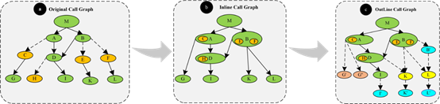
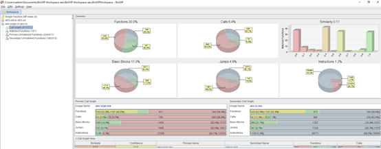
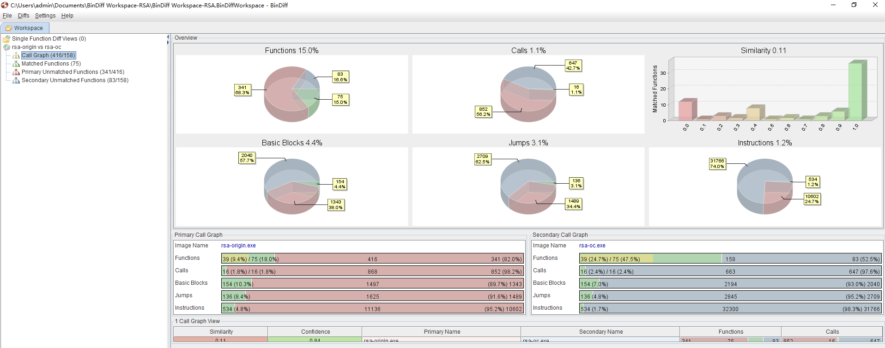
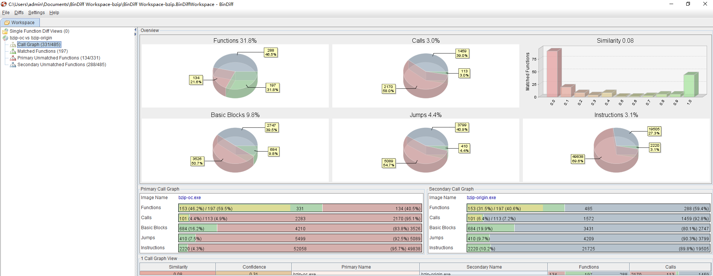
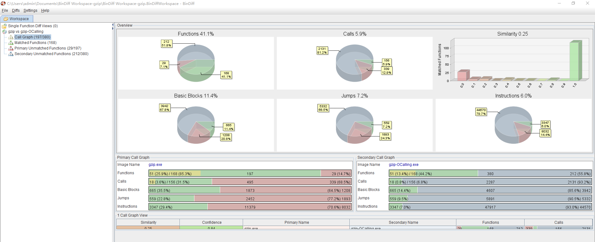
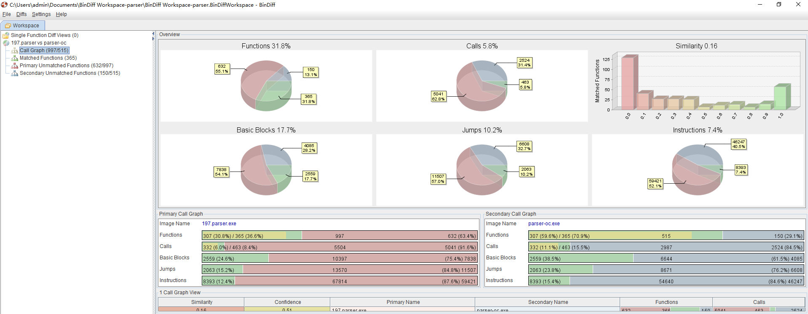
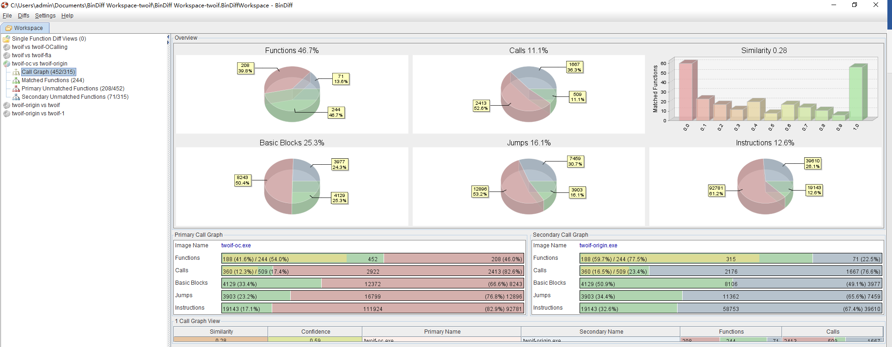

# Othread Obfuscator

COOPS is an obfuscation tool based on LLVM, which can perfectly realize the obfuscation of C/C++ code under the Windows platform of x86 architecture.

## 0x01 Principle

We propose COOPS for protecting software based on program semantic information, in which functions are regarded as basic semantic units, and the switch relationship between the intra-function control flow and the inter-function calling is established. The inter-function calling can be hidden in the intra-function control flow, and in reverse the intra-function control flow can also be converted to inter-function calling. 

## 0x02 How to use

1. Compile the source code and ".\source\*.cpp" into LLVM intermedia representation
2. Utilize llvm-link to merge all intermedia representation files into one
3. Input the file generated by step2, ".\obfuscator\COOPS.exe" will output obfuscated intermedia representation
4. Link the file output by step3 to generate an executable file

Usage: `COOPS.exe ..\example\aes\aes.bc ..\example\aes\aes-obf.bc`

## 0x03 Example

1. aes		symmetric cryptographic algorithm	`Usage:aes.exe`
2. rsa		asymmetric cryptographic algorithm	`Usage:rsa.exe`
3. bzip		Lexical analyzer					`Usage:bzip.exe    ./input/input.random`
4. gzip		Compression algorithm				`Usage:gzip.exe    ./input/input.combined`
5. parser	Grammar Parser    				    `Usage:parser.exe  ./input/input.combined`
6. twoif	Simulated annealing algorithm		`Usage:twoif.exe   ./input/test`

*Table1 Program execution Cost before and after obfuscation*

 | example | time | size | 
 | ------- | -----| -----|
 | aes     | 1.05 | 1.04 |  
 | rsa     | 1.04 | 1.11 |   
 | bzip    | 1.02 | 1.05 |  
 | gzip    | 1.12 | 1.39 |  
 | parser  | 1.22 | 1.72 |   
 | twoif   | 1.25 | 1.82 |   

## 0x04 Screenshot

*Figure1 Program similarity before and after obfuscation-aes*

*Figure2 Program similarity before and after obfuscation-rsa*

*Figure3 Program similarity before and after obfuscation-bzip*

*Figure4 Program similarity before and after obfuscation-gzip*

*Figure5 Program similarity before and after obfuscation-parser*

*Figure6 Program similarity before and after obfuscation-twoif*

## 0x05 Paper

You can get our paper one week later